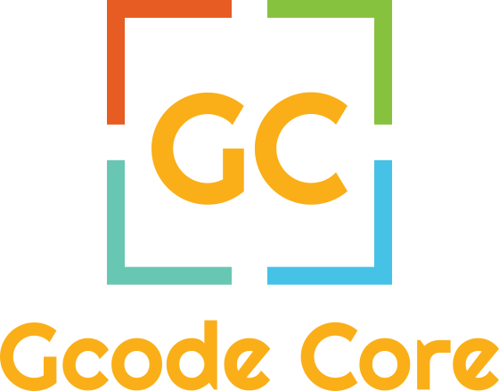

# gcode-core

&nbsp;
<div align="center">
	


</div>

<h4 align="center">Manipulate and edit G-code commands, blocks and files.</h4>

&nbsp;
<div align="center">

<a href="https://github.com/mauroalderete/gcode-core/blob/main/LICENSE">
	
</a>
<a href="https://github.com/mauroalderete/gcode-core/blob/main/CODE_OF_CONDUCT.md">
	
</a>
<a href="https://semver.org/">
	
</a>
<a href="https://pkg.go.dev/github.com/mauroalderete/gcode-core">
	
</a>

[](https://github.com/mauroalderete/gcode-core/actions/workflows/prod-test.yml)

<a href="https://github.com/mauroalderete/gcode-core/issues/new/choose">Report Bug</a>
·
<a href="https://github.com/mauroalderete/gcode-core/issues/new/choose">Request Feature</a>

<a href="https://github.com/mauroalderete/gcode-core/discussions">
	
</a>
<a href="https://twitter.com/intent/tweet?text=👋%20Check%20this%20amazing%20repo%20https://github.com/mauroalderete/gcode-core,%20created%20by%20@_mauroalderete%0A%0A%23DEVCommunity%20%23100DaysOfCode%20%23Golang%20%23gcode">
	
</a>
</div>

&nbsp;
# :wave: Introducing `gcode-core`
`gcode-core` is a Golang library to model, manipulate and edit G-code commands, blocks and files. Easily, you can open gcode files and apply them to all kinds of massive operations that come to mind.

- Do you need to apply skew correction to files before sending to your CNC machine them?
- Do you wish to insert gcode snippets to change the temperature or a tool regularly?
- Do you like to verify each gcode line?
- Or calculate extra info in your files simply?

`gcode-core` gives you a set of interfaces and objects to help you accomplish your goals simplifying manipulating your gcode files at a low level.

# :computer: Use `gcode-core`

Simply add an import statement into your project to start using.

Some like that:

```go
import (
    "fmt"
    "log"
    "https://github.com/mauroalderete/gcode-core/block/gcodeblock"
)
```

Later, use it:

```go
func main() {
	// we define a gcode line to parse
	const source = "N7 G1 X2.0 Y2.0 F3000.0"

    // convert a string statement into a gcode block model
	block, err := gcodeblock.Parse(source)
	if err != nil {
		log.Fatal(err)
	}

    // calculate and get the checksum gcode of our new block
	gcode, err := b.CalculateChecksum()
	if err != nil {
		log.Fatal(err)
	}

    // show the checksum!
	fmt.Printf("the gcode checksum is: %s\n", gcode)

	// Output:
	// the gcode checksum is: *85
}
```

There are many packages you can import. Some export concrete implementations that you can start to interact with your files speedily. Instead, others export interfaces and constructors that allow you to use them with dependency injection patterns.

Please, feel free to examine the [`documentation`](https://pkg.go.dev/github.com/mauroalderete/gcode-core) and [`contribute`](CONTRIBUTING.md) by writing any question, suggestion or issue using our [`discussion channels`](https://github.com/mauroalderete/gcode-core/discussions) or creating a [`new issue`](https://github.com/mauroalderete/gcode-core/issues/new/choose).

# :fire: Features

With `gcode-core` you can do the following

## Model Gcode commands and blocks

It implements many ways to get gcode or block instances. With them, you can get a summary or modify his values and apply some logic or math operations.

## Validate blocks

- Allow you to review if a block is valid or not
- Update checksum
- Change the validation algorithm
- Add a checksum gcode if your slicer does not do it.

## Manage gcode addressable and gcode unaddressable separately way

Most gcode commands use an address element to add some information about that do it. However, some circumstantial gcode commands do not require an address element like the gcodes `M` or `G` when used without an address value.

`gcode-core` provide interfaces and implementations to handle both situations discriminately.

## Dependency Injection

The packages provide the interfaces needed you can use to implement within your own dependency injection strategy.

## Customizable interfaces 

Sometimes the implementations exported maybe not be enough. For these cases, all packages give you interfaces with which you can implement your own 'gcode' and 'block' models or extend them exists.

# :rocket: Upcomming Features

`gcode-core` has all the potential to grow further. Here are some of the upcoming features planned (not in any order),

- ✔️ Handle files.
- ✔️ Mapping gcode commands and improving validating block.
- ✔️ Cloning blocks and gcode.
- ✔️ Convert gcode data types.
- ✔️ Improve compatibility with [`RFCRS274NGC`](https://www.nist.gov/publications/nist-rs274ngc-interpreter-version-3?pub_id=823374).

# :building_construction: How to Set up `gcode-core` for Development?

You set up `gcode-core` locally with a few easy steps.

1. Clone the repository

```bash
git clone https://github.com/mauroalderete/gcode-core
```

2. Change the working directory

```bash
cd gcode-core
```

3. Restore module

```bash
go mod tidy
```

4. You can run all unit tests and examples to check it's working

```bash
go test ./...
```

5. Optionally, if you have godocs installed, You can run a server to access documentation via website at localhost.

```bash
GOROOT=$GOPATH godoc -http=localhost:9090
```
# :hamburger: Built With

- [Golang](https://go.dev/) 1.18

# :shield: License

This project is licensed under the MIT License - see the [`LICENSE`](LICENSE) file for details.

# :handshake: Contributing to `gcode-core`

Any kind of positive contribution is welcome! Please help us to grow by contributing to the project.

If you wish to contribute, you can work on any features [listed here](https://github.com/mauroalderete/gcode-core#rocket-upcomming-features) or create one on your own. After adding your code, please send us a Pull Request.

> Please read [`CONTRIBUTING`](CONTRIBUTING.md) for details on our [`CODE OF CONDUCT`](CODE_OF_CONDUCT.md), and the process for submitting pull requests to us.

# :pray: Support

We all need support and motivation. `gcode-core` is not an exception. Please give this project a :star: start to encourage and show that you liked it. Don't forget to leave a :star: star before you move away.

If you found the app helpful, consider supporting us with a coffee.

&nbsp;
<div align="center">
<a href='https://cafecito.app/mauroalderete' rel='noopener' target='_blank'></a>
</div>
